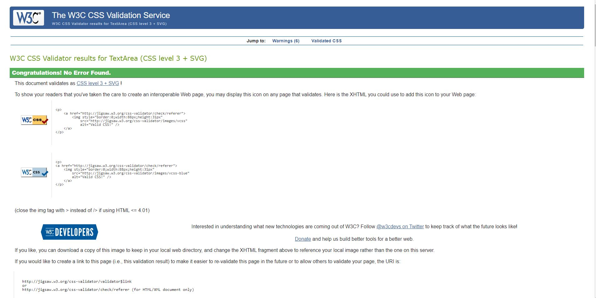
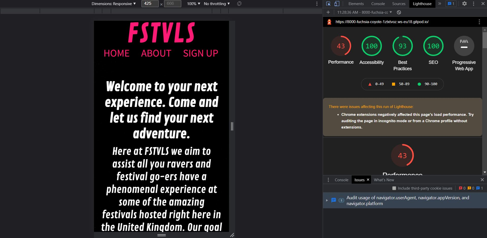

FSTVLS
- The FSTVLS website is website for people who are interested in festivals and are planning thier next trip. The websites offers insight and history of certain festivals for those who want to know more.

This site is targeted for people age 17 and onwards who enjoys music and the festival atmosphere. Users can sign up for the newletter that provides them with more information about upcoming festivals and what supplies to buy beforehand. 

Features
- Navigation
    - Featured at the top of the page is the website logo: FSTVLS that links to the home page
    - The Logo is in the center of the page as opposed to being on the left.
    - The other navigation links are to the right: About, Sign Up.
    - The Contact information is in the footer of the page and links to all the relevant social media sites.
    - The navigation is in a bright pink font so that it stands out from the black bound and adds a neon vibe to the page.

- The Header
    - The header clearly outlines the goal of the site
    - It offers a welcoming message and in the paragrapgh there a link that goes straight to the sign up page.

- About
    - The About page feautures the history of certain festivals that have a huge attendance in the UK.
    - It also has relevant pictures along is it

- Sign Up
    - The Sign Up page allows users to sign up for the newsletter provided by FSTVLS that provides additional information
    - It has a section where users can choose their preferred choice of music so the newsletter can be tailored more towards their preferrences.

- Contact
    - The contact section features icons that link to Facebook, Instagram, Twitter and TikTok.
    - This section is valuable as leads them to social media sites where can engage with more of the content

Bugs

 - There were no bugs found

Validator Testing:

HTML
- I found that I had duplicate sections in my about.html so I deleted them
- There were no other errors found in my index.html, about.html and sign-up.html

CSS
    - There were no errors found in my CSS stylesheet
    http://jigsaw.w3.org/css-validator/validator$link

Lighthouse
- My perfomance rating had problems due to the extensions I have on google chrome
- There were no other problems and my scores were nearly all at 100
- you can also see how the site looks on a mobile phone

Unfixed bugs
- Bug on google chrome that limits lighthouse from perming properly

Deployment
- 